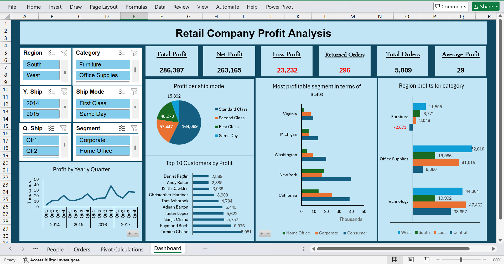

# retail-profit-analysis-excel
Excel-based data analysis project focused on retail profit performance, including trends, customer profitability, shipping modes, and regional insights. The project demonstrates data cleaning, pivot tables, KPIs, and dashboard design for business decision-making.

# Retail Company Profit Analysis (Excel)

## Project Overview
This project analyzes retail sales data to evaluate profit performance across different dimensions such as time, region, category, customer, and shipping mode. The goal is to provide clear insights that support business decision-making.

## Dataset
- Retail sales dataset (educational sample)
- Includes orders, customers, regions, categories, discounts, and profit values

## Tools Used
- Microsoft Excel
- Pivot Tables
- Pivot Charts
- Formulas
- Slicers
- Dashboard Design

## Key Business Questions
- What is the total profit for each year?
- Which ship mode generates the highest profit?
- Who are the top 10 customers by profit?
- Which segment is the most profitable by city and state?
- How does profit vary by region, category, and subcategory?

## Dashboard Highlights
- Profit KPIs (Total Profit, Net Profit, Loss, Orders)
- Profit trend by year and quarter
- Profit distribution by shipping mode
- Regional and category-based profit comparison
- Top customers by profitability
  

## Key Insights
- Standard Class shipping generates the highest profit.
- Technology category shows strong profitability across regions.
- A small number of customers contribute a significant portion of total profit.
- Discounts have a noticeable impact on net profit.

## Files Included
- Excel dashboard file
- Cleaned data sheets
- Pivot calculations

## Notes
This project was created for learning and portfolio purposes using a public/educational dataset.
